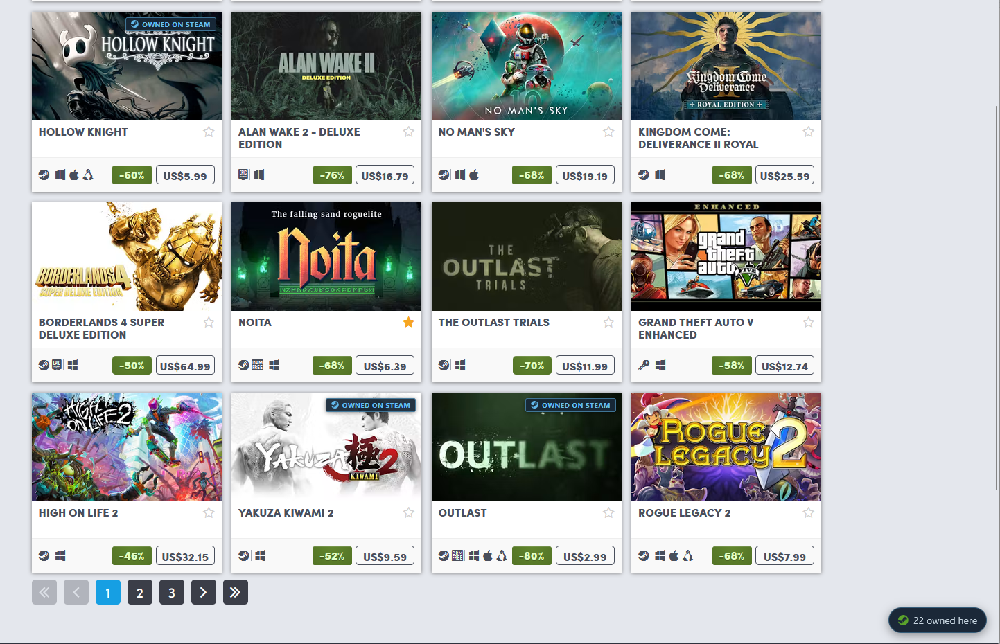
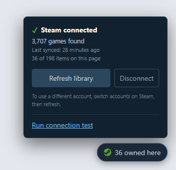
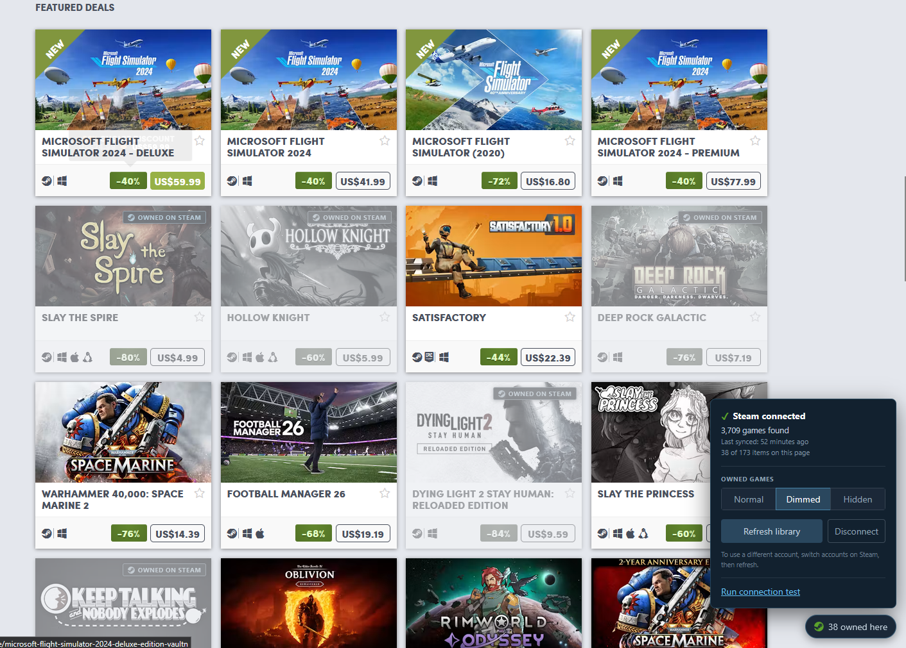

# Owned on Steam

A userscript that tells you which games you already own on Steam while you
browse a game store — before you buy one twice.

[](LICENSE)




**No Steam API key. No profile URL. Nothing to edit in the source.**

---

## Install

1. Install a userscript manager — [Violentmonkey](https://violentmonkey.github.io/)
   or [Tampermonkey](https://www.tampermonkey.net/).
2. [**Install the script**](https://raw.githubusercontent.com/ibrahim-mousa/game-ownership-checker/master/owned-on-steam.user.js)
   — your manager will offer to install it and keep it updated.
3. Make sure you are **signed in to Steam** in the same browser.
4. Open [humblebundle.com/store](https://www.humblebundle.com/store) and click
   **Connect Steam** in the bottom-right corner.



### Display options

The panel offers one setting with three states:

| Mode | Owned games |
| --- | --- |
| **Normal** | badged, otherwise untouched |
| **Dimmed** | faded and desaturated; hover to restore |
| **Hidden** | removed from the page |



**Hidden only ever hides a certain match** — an appid, exact title or alias.
Inferred matches (*Base game owned*) are dimmed instead, because hiding one
would silently remove a game you may not actually own, leaving nothing on the
page to notice the mistake. A wrong badge is visible and correctable; a wrongly
hidden card is neither.

Your library is cached locally and refreshed automatically once a day.

**Updates are automatic.** Your userscript manager polls the script and installs
new versions. The panel also shows a one-line notice when a newer version is
available, in case auto-update is off or hasn't run yet.

---

## Why no API key?

Your library is read through the Steam session already in your browser. The
userscript manager's `GM_xmlhttpRequest` sends your Steam cookies, so the
request is made **as you**:

| Endpoint | Gives us |
| --- | --- |
| `steamcommunity.com/my/games?tab=all` | the page that carries a web API token |
| `api.steampowered.com/…/GetOwnedGames` | your library, using that token |
| `store.steampowered.com/dynamicstore/userdata/` | owned appids (optional supplement) |

This means **private libraries work** — you do not have to make your game
details public. The only requirement is being signed in to Steam.

Nothing is uploaded anywhere. Your library is stored by your userscript manager
and only ever compared against titles on the page.

---

## How matching works

Humble and Steam rarely spell a title the same way, so matches are tried in
descending order of confidence:

| # | Tier | Badge | Example |
| --- | --- | --- | --- |
| 1 | **Steam appid** | Owned on Steam | appid `292030` on both sides |
| 2 | **Exact normalised title** | Owned on Steam | `The Witcher® 3: Wild Hunt` |
| 3 | **Alias** — curated by hand | Owned on Steam | see [`ALIASES`](owned-on-steam.user.js) |
| 4 | **Edition suffix** | depends on direction | `Borderlands 2` ↔ `Borderlands 2 GOTY` |
| — | No match | *no badge* | |

**There is no fuzzy matching.** The matcher only does what it can justify from
the text; anything normalisation cannot bridge belongs in `ALIASES`, where a
human has checked it. You can review an alias — you cannot easily review a
heuristic. A missing badge is a much better failure than a wrong one.

Normalising strips `™ ® © ℠`, accents, apostrophes and punctuation, expands `&`,
converts multi-letter roman numerals (`VI` → `6`), ignores spacing differences
(Steam's `HunterX` is Humble's `Hunter X`), and removes trailing edition names. A bare qualifier is only stripped when unambiguous (`GOTY`,
`Remastered`); otherwise the word *Edition* must actually be present — which is
what stops `Persona 5 Royal` collapsing to `Persona 5`, and `Portal Reloaded`
to `Portal`.

<details>
<summary>Why edition matches are directional</summary>

- **Your Steam name has the edition suffix, Humble's doesn't** — you own a
  superset, and an edition always contains the base game. Badged as owned.
  This is the common case, because Steam renames base apps outright: appid
  `292030` is titled `The Witcher 3: Wild Hunt - Complete Edition` for everyone
  who bought it in 2015.
- **Humble's listing has the edition suffix, your Steam name doesn't** — you own
  less than what is on sale. Badged as *Base game owned*, with a dashed border.

Steam is inconsistent here and you cannot tell from the name alone:
`Borderlands 2` (`49520`) and `Borderlands 2 Game of the Year` (`32848`) are
separate apps, while `The Witcher 3 … Complete Edition` is the same app renamed.

Demos, open betas and playtests are excluded from your library before matching —
`GetOwnedGames` includes played free games, so having tried the
`Street Fighter 6 Open Beta` would otherwise badge `Street Fighter 6` as owned.
The filter is deliberately specific: a bare `/beta|alpha/` would discard real
games such as `Alpha Protocol`.

</details>

Hover any badge to see which Steam title it matched and why.

---

## Contributing

Contributions are welcome — especially aliases and selector fixes, which need no
setup beyond a text editor.

### Adding an alias

Aliases handle renamed, bundled and oddly-worded titles. On a Humble page, open
the browser console and run `steamowned.unmatched()`, then copy the `normalized`
column as your key.

Note that the name in your Steam **library** can differ from the name on the
Steam **store page** — `GetOwnedGames` reports app `534380` as
`Dying Light 2: Reloaded Edition`, while the store calls it
`Dying Light 2 Stay Human: Reloaded Edition`. Key the alias on what the *store
you are browsing* calls it. Take the appid from the Steam store URL
(`store.steampowered.com/app/945360/`):

```js
const ALIASES = {
  'among us 4 pack': 945360,   // multi-copy pack; owning the game covers it
};
```

Values may be an appid (preferred, most precise) or a normalised Steam title.
Please include a comment saying why the entry is needed, and add a case to
[`test/matcher.test.js`](test/matcher.test.js).

### Fixing a broken page

Humble changes its markup regularly. Every DOM hook lives in the `ADAPTERS` list
near the top of the script as an ordered list of candidate selectors, so fixing
a page usually means adding one selector. Run `steamowned.diagnose()` to see which
selectors match on the page you are looking at.

### Releasing

Bump **`@version` in the metadata block and the `VERSION` constant together**,
then push to `master`. That's the whole process — userscript managers poll
`@updateURL` and install the new version.

Ship a change without bumping `@version` and nobody ever receives it, silently
and with no error anywhere. `test/meta.test.js` fails if the two version numbers
disagree, and if any host the script fetches is missing from `@connect`.

### Running the tests

No dependencies, no build step:

```bash
node test/run.js
```

| Suite | Covers |
| --- | --- |
| [`meta.test.js`](test/meta.test.js) | release hygiene: version sync, update URLs, `@connect` coverage, grants |
| [`matcher.test.js`](test/matcher.test.js) | normalisation, tiers, aliases — and the false positives each guard exists to prevent |
| [`parser.test.js`](test/parser.test.js) | scraping Steam's profile page, both layouts, and the failure modes that must not look like an empty library |
| [`panel.test.js`](test/panel.test.js) | the UI against a small DOM stub, including interaction bugs a syntax check cannot see |

The "must **not** match" cases are the important half. If you change
normalisation or add an alias, add a case there.

> The CSS lives inside a JS template literal, so a stray backtick breaks the
> file. `node --check owned-on-steam.user.js` catches it instantly.

---

## Troubleshooting

Open the panel and click **Run connection test**. It probes one thing at a time
and explains the result in plain English.

When something needs reporting, the panel shows a **Report this on GitHub**
link that opens a pre-filled issue — script version, browser, every probe
result and the page structure. No copying tables by hand.

A `200` from Steam proves nothing on its own — signed out, Steam answers `200`
with a login page or an empty payload — so the test reads response *bodies*:
the `steamcommunity.com` row reports `signed in` or `SIGNED OUT`, and the games
row reports how many games were parsed.

| Symptom | Cause |
| --- | --- |
| Every row `blocked (status 0)` | The userscript manager is denying cross-origin access, or the extension's site access is limited |
| `SIGNED OUT` | Cookies are not reaching Steam — check you are signed in at steamcommunity.com |
| `markup not recognised` | Steam changed its page. The panel shows a **Report this on GitHub** link with the diagnostics already filled in |
| `xml feed (retired)` failing | **Expected.** Shown for reference only |

### Console helpers

The script exposes `steamowned` on the page. Userscript managers sandbox scripts
that use `@grant`, so depending on your browser this may not be reachable from
the console — the panel button always is.

| Command | Does |
| --- | --- |
| `steamowned.unmatched()` | page items that did **not** match, with their normalised forms |
| `steamowned.diagnose()` | which card selectors matched, and how many are products |
| `steamowned.badges()` | every badge in the page, and whether it actually renders |
| `steamowned.match('Some Title')` | tests one title against your library |
| `steamowned.debugAll()` | the connection test, with full response objects |
| `steamowned.sync()` / `steamowned.rescan()` / `steamowned.reset()` | force a refresh, re-badge, clear |

---

## Roadmap

- [x] **Phase 1 — Humble Bundle.** Zero-config connect, tiered matching,
      badges, display modes.
- [ ] **Phase 2 — More stores: GOG and Fanatical.** Refactor the adapters into
      a per-store registry so a new store is one entry rather than a fork. One
      script covers every store: userscript storage is per-script, so separate
      scripts would mean syncing and storing your library once per store.
- [ ] **Phase 3 — Green Man Gaming**, plus whatever the registry makes cheap.
- [ ] **Later** — resolving store titles to appids via Steam's keyless
      `storesearch` endpoint, which would make every match certain and retire
      most of `ALIASES`. Smarter caching. An optional API key for checking an
      account you are not signed in to.

The badge is *information*, not a warning — it says "you already own this on
Steam", and what you do with that is your business. That holds on GOG as much
as anywhere: plenty of people mean to buy a DRM-free copy of something they own
on Steam, and plenty of others simply forgot they owned it at all.

Bundle-page selectors are currently unverified — `steamowned.diagnose()` reports
`0` cards there. Help welcome.

## License

[MIT](LICENSE) © Ibrahim Mousa
